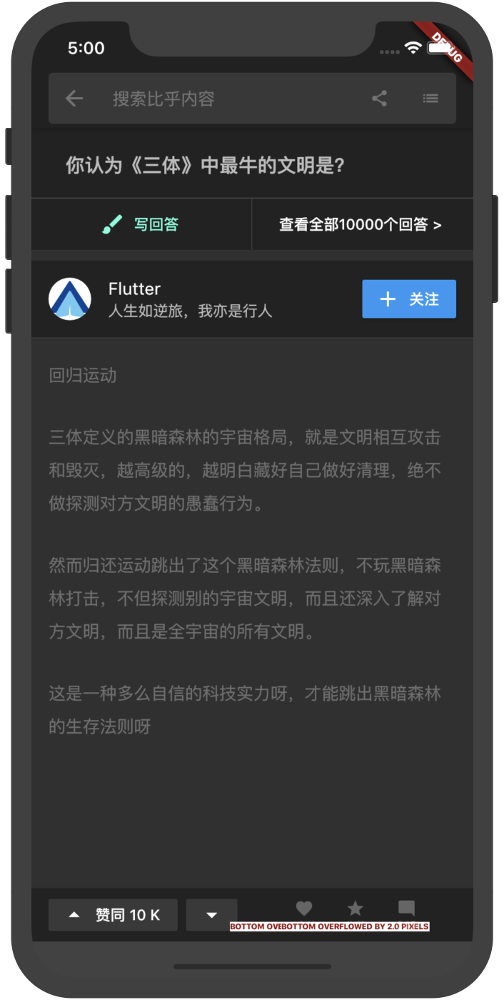
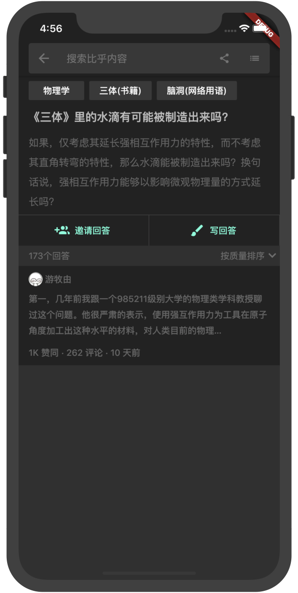

# 知乎 - Flutter UI

使用 Flutter 模仿的知乎深色和浅色主题的 UI。
首先要看一下dart语言，了解基本的用法。
主要是Flutter的创建，布局，组件，组件之间的通信，与原生之间的通信，缓存，网络，适配，框架等。
可以看看https://github.com/CarGuo/GSYGithubAppFlutter 作者写的的Demo很好，包含了Kotlin,React Native, Fluter, Weex,可以了解大部分的知识点。

## APP截图
<table>
  <tr>
    <td></td>
    <td></td>
    <td></td>
  </tr>
    <tr>
    <td></td>
    <td>	</td>
    <td></td>
  </tr>
  <tr>
    <td></td>
    <td>	</td>
    <td>	</td>
  </tr>
</table>
