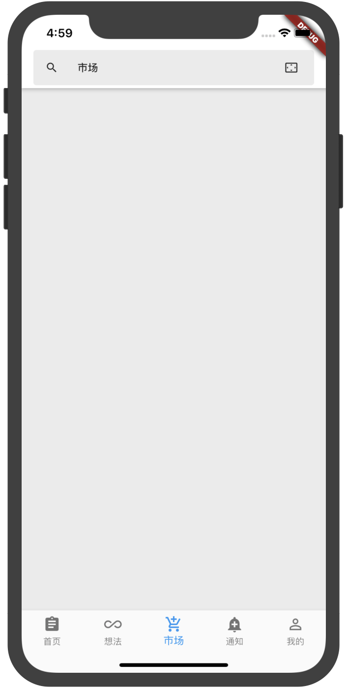

# 知乎 - Flutter UI

使用 Flutter 模仿的知乎黑色主题的 UI。

## APP截图
<table>
  <tr>
    <td></td>
    <td></td>
    <td></td>
  </tr>
    <tr>
    <td></td>
    <td>	</td>
    <td></td>
  </tr>
  <tr>
    <td></td>
    <td>	</td>
    <td>	</td>
  </tr>
</table>
