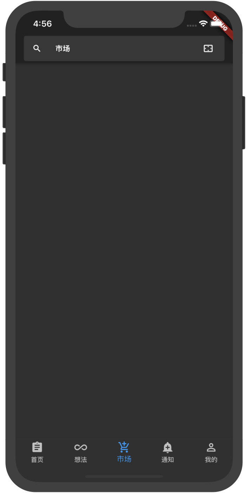

# 知乎- Flutter 高仿版 UI

使用 Flutter 模仿的知乎黑色主题的 UI。

在 “我的” 页中可以修改日间和夜间模式。

这是我当初初学时做的一个 demo ，看着代码做一遍基本可以入门 Flutter，学会 APP 布局。

照着这个 demo ，两三天做下来，一周入门不是问题。

现在我使用 Flutter 已经 5，6 个月了。我的更多 Flutter 的分享在：https://zhuanlan.zhihu.com/flutter

## APP截图
<table>
  <tr>
    <td></td>
    <td></td>
    <td></td>
    <td>	</td>
    <td>	</td>
  </tr>
</table>
